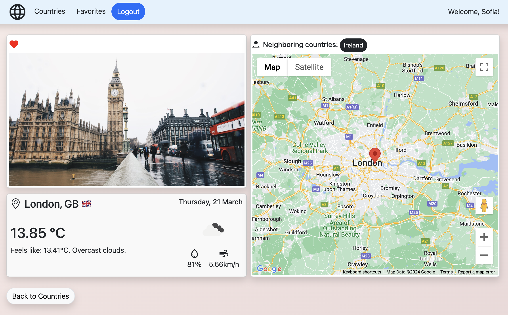

# Countries App

The application allows to discover the world. Register and explore the app by searching through countries, add/delete favorites which are unique to each user.

## Technologies used

Built with:

- HTML
- CSS
- Bootstrap
- React
- React Toolkit
- Firebase
- React Google Maps

## Sources

- REST Countries API
- Open weather API
- Google Maps Javascript API
- www.unsplash.com

## Screenshot

### **Check it out!**

[Country app](https://prismatic-truffle-4fe353.netlify.app)
